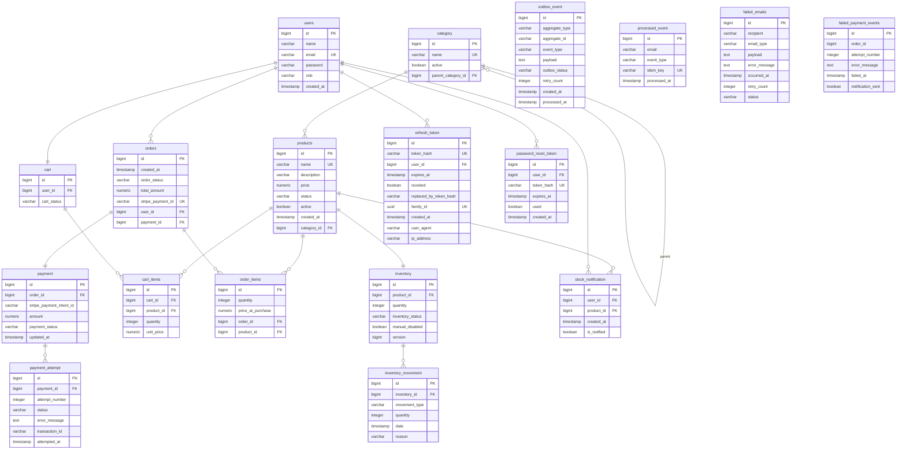

# Database Model

## 1. Entity-Relationship Diagram



---

## 2. Data Dictionary

### Core Domain

| Table | Purpose | Parent (FK) | Children | Cardinality Notes |
|---|---|---|---|---|
| **users** | Registered users. Implements `UserDetails` for Spring Security auth (email = username). | — | `orders`, `cart`, `refresh_token`, `password_reset_token`, `stock_notification` | 1 user → 1 cart (`@OneToOne`), 1 user → N orders, N refresh tokens, N password reset tokens |
| **category** | Product categories with self-referencing hierarchy (subcategories via `parent_category_id`). | `category.parent_category_id` → `category.id` | `products` | Self-referencing: parent → N children. A product belongs to exactly 1 category. |
| **products** | Product catalog. Each product maps to exactly one `inventory` row and belongs to one `category`. | `category_id` → `category.id` | `cart_items`, `order_items`, `stock_notification` | 1 product → 1 inventory (`@OneToOne`), N cart_items, N order_items |
| **inventory** | Stock counter per product. Has `version` column (legacy optimistic locking) plus `@PrePersist`/`@PreUpdate` that auto-syncs `inventory_status` (`IN_STOCK` / `OUT_OF_STOCK`) based on `quantity` and `manual_disabled`. | `product_id` → `products.id` | `inventory_movement` | 1 inventory → N movements |
| **inventory_movement** | Audit log of every stock change (`RESTOCK`, `SALE`, `RETURN`, `ADJUSTMENT`). | `inventory_id` → `inventory.id` | — | N movements per inventory |

### Cart & Checkout

| Table | Purpose | Parent (FK) | Children | Cardinality Notes |
|---|---|---|---|---|
| **cart** | Active shopping cart per user (1 cart per user enforced by `UNIQUE(user_id)`). | `user_id` → `users.id` | `cart_items` | 1 cart → N items |
| **cart_items** | Line items in a cart with quantity and unit price (snapshot at add time). | `cart_id` → `cart.id`, `product_id` → `products.id` | — | N items per cart, each referencing 1 product |

### Ordering & Payments

| Table | Purpose | Parent (FK) | Children | Cardinality Notes |
|---|---|---|---|---|
| **orders** | Completed orders. Links user, payment, and line items. Has a unique `stripe_payment_id` for Stripe idempotency. | `user_id` → `users.id`, `payment_id` → `payment.id` | `order_items` | 1 order → N items, 1 order → 1 payment |
| **order_items** | Snapshot of each product at purchase time (quantity + price_at_purchase). | `order_id` → `orders.id`, `product_id` → `products.id` | — | N items per order |
| **payment** | Payment record per order (bidirectional `@OneToOne` with `orders`). Tracks Stripe PaymentIntent ID and status. | `order_id` → `orders.id` | `payment_attempt` | 1 payment → N attempts |
| **payment_attempt** | Retry history for a payment. Records each attempt's status, error, and transaction ID. | `payment_id` → `payment.id` | — | N attempts per payment |

### Auth & Security

| Table | Purpose | Parent (FK) | Children | Cardinality Notes |
|---|---|---|---|---|
| **refresh_token** | Refresh token rotation with family binding (detects token reuse/theft via `family_id`). | `user_id` → `users.id` | — | N tokens per user |
| **password_reset_token** | One-time password reset links. Expires after TTL, marked `used` after consumption. | `user_id` → `users.id` | — | N tokens per user |

### Notifications

| Table | Purpose | Parent (FK) | Children | Cardinality Notes |
|---|---|---|---|---|
| **stock_notification** | Back-in-stock subscription requests. `is_notified` flag prevents duplicate notifications. | `user_id` → `users.id`, `product_id` → `products.id` | — | N subscriptions per user, N per product |

### Outbox & Idempotency

| Table | Purpose | Parent (FK) | Children | Cardinality Notes |
|---|---|---|---|---|
| **outbox_event** | Transactional outbox: events written in same DB transaction as business data, polled by `OutboxScheduler` and published to Kafka. Composite index on `(outbox_status, created_at)`. | — | — | Standalone (no FK relationships) |
| **processed_event** | Idempotency key table: `idem_key` (messageId) prevents duplicate side-effects in Kafka consumers. | — | — | Standalone |

### Failure Tracking

| Table | Purpose | Parent (FK) | Children | Cardinality Notes |
|---|---|---|---|---|
| **failed_emails** | Emails that exhausted Kafka retries (3 attempts). Stored for manual reprocessing. | — | — | Standalone |
| **failed_payment_events** | Payment retries that exhausted 6 Kafka retries. Triggers an admin alert email. | — | — | Standalone |

### Legacy/Dropped

| Table | Status | Notes |
|---|---|---|
| **tokens** | **Dropped in V10** | JWT blacklist — replaced by Redis-based token validation. |
| **cart_item** (legacy) | **Present in V1 baseline** | Old Hibernate-generated table with columns `cart` and `product` (lowercase). Superseded by `cart_items`. |

---

## 3. Pessimistic Locking (PESSIMISTIC_WRITE)

### Where it's applied

**`InventoryRepository`** — two query methods:

```java
@Lock(LockModeType.PESSIMISTIC_WRITE)
@EntityGraph(attributePaths = {"product"})
Optional<Inventory> findByProductId(Long id);

@Lock(LockModeType.PESSIMISTIC_WRITE)
Optional<Inventory> findWithLockByProductId(Long productId);
```

**`StockNotificationRepository`** — one query method:

```java
@Lock(LockModeType.PESSIMISTIC_WRITE)
@Query("SELECT sn FROM StockNotification sn WHERE sn.product.id = :productId AND sn.isNotified = false")
List<StockNotification> findByProductIdAndIsNotifiedFalse(Long productId);
```

### Why pessimistic locking for inventory

The inventory row is the **single source of truth** for stock. Without locking, the following race condition can occur:

```
Time  ──────────────────────────────────────────────────────────────►

Thread A (Order #1)                    Thread B (Order #2)
  │                                      │
  ├─ READ inventory(qty=1)               │
  │   (sees qty=1)                       │
  │                                      ├─ READ inventory(qty=1)
  │                                      │   (sees qty=1)
  ├─ WRITE inventory(qty=0)              │
  │   (commits)                          │
  │                                      ├─ WRITE inventory(qty=0)
  │                                      │   (commits — oversold!)
  ▼                                      ▼
```

With `SELECT ... FOR UPDATE` (generated by `PESSIMISTIC_WRITE`), Thread B blocks on the `READ` until Thread A's transaction commits:

```
Time  ──────────────────────────────────────────────────────────────►

Thread A                               Thread B
  │                                      │
  ├─ SELECT ... FOR UPDATE (locks row)   │
  │   (qty=1)                            │
  │                                      ├─ SELECT ... FOR UPDATE
  │                                      │   (BLOCKS — waiting for A)
  ├─ UPDATE qty=0                        │
  ├─ COMMIT (releases lock)              │
  │                                      │   (resumes, reads qty=0)
  │                                      ├─ sees insufficient stock
  │                                      ├─ ROLLBACK / throws error
  ▼                                      ▼
```

### Dual protection strategy

The repository also provides an **atomic UPDATE** as a second line of defense:

```java
@Query("UPDATE Inventory i "
     + "SET i.quantity = i.quantity - :amount "
     + "WHERE i.product.id = :productId "
     + "AND i.quantity >= :amount "
     + "AND i.manualDisabled = false")
int decrementStockAtomic(Long productId, Integer amount);
```

This is used in `CartServiceImpl` for cart-level stock reservations where full transactional locking is not required. The `WHERE` clause itself enforces the invariant (`quantity >= amount`), acting as an optimistic guard without holding row locks across the entire transaction.

### Usage in `OrderServiceImpl` (checkout flow)

```
@Transactional
createOrder():
  1. cartItem loop:
     inventoryRepository.findWithLockByProductId(productId)
     → SELECT ... FOR UPDATE on inventory row
     → If stock insufficient → throw
  2. inventory.decrementBy(amount)  ← in-memory
  3. outboxService.saveOutboxEvent(...)  ← same TX
  4. paymentService.processPayment(...)  ← Stripe API
  5. orderRepository.save(order)
  COMMIT
     → inventory row written, outbox event visible
     → lock released
```

The lock is held from step 1 until the COMMIT, preventing any concurrent checkout from reading stale stock for the same product.

### Where pessimistic locking is NOT used

- **Cart operations** use `decrementStockAtomic()` (optimistic UPDATE with WHERE guard) instead of `findWithLockByProductId()`. This is because cart modifications are non-critical (users can re-add items) and avoiding row locks reduces contention during browsing.
- **Stock notifications** use `PESSIMISTIC_WRITE` (`StockNotificationRepository.findByProductIdAndIsNotifiedFalse()`) to prevent multiple concurrent threads from sending duplicate "back in stock" emails for the same product.
