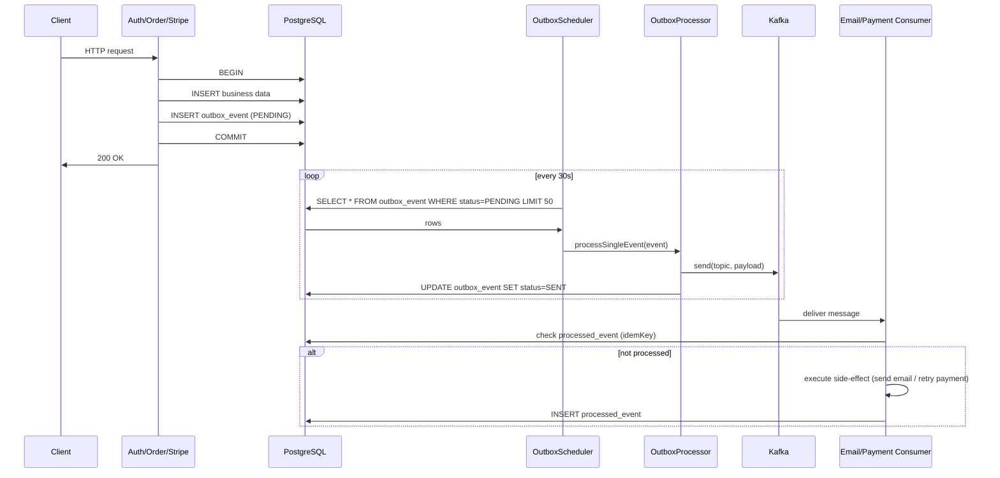

# Event-Driven Architecture

## Outbox Pattern (Transactional Outbox)

Services write events to the `outbox_event` table **within the same local transaction** as the business operation (order creation, payment processing, etc.). A separate scheduled component polls this table and publishes to Kafka. This guarantees at-least-once delivery without distributed transactions (XA).

```
┌──────────────┐     ┌──────────────────┐     ┌─────────────────────┐
│  Service     │     │  PostgreSQL       │     │  Kafka              │
│  (e.g. Auth, │──1──>│                  │     │                     │
│   Order)     │     │  outbox_event ──2──>│   │  stock-emails-topic  │
│              │     │  (PENDING rows)   │     │  order-emails-topic  │
│              │     │  processed_event  │     │  payment-retry-topic │
│              │     │  (idempotency)    │     │  ...                 │
└──────────────┘     └──────────────────┘     └─────────────────────┘
                         ▲                            │
                         │                            │
                      ┌──┴──────────┐                 │
                      │  Outbox     │                 │
                      │  Scheduler  │────3─────────────┘
                      │  (30s poll) │
                      └─────────────┘
```

1. Service writes business data + `OutboxEvent(status=PENDING)` in the same DB transaction.
2. `OutboxScheduler` polls `findTop50ByOutboxStatusOrderByCreatedAtAsc(PENDING)` every 30 seconds.
3. `OutboxProcessor.processSingleEvent()` deserializes the payload, calls the appropriate Kafka producer, and marks `SENT` (or `FAILED`).

### Sequence Diagram



## Topics

| Topic | Partitions | Producers | Consumers | Payload | Retries |
|---|---|---|---|---|---|
| `stock-emails-topic` | 3 | `EmailKafkaProducer` | `EmailKafkaConsumer` | `EmailRequest` | 3×5s, DLQ → `FailedEmail` |
| `order-emails-topic` | 1 | `OrderKafkaProducer` | `OrderKafkaConsumer` | `OrderPlacedEvent` | 3×5s |
| `user-registered-topic` | 1 | `UserRegisteredKafkaProducer` | `UserRegisteredKafkaConsumer` | `UserRegisteredEvent` | 3×5s, DLQ → `FailedEmail` |
| `password-reset-topic` | 1 | `PasswordResetKafkaProducer` | `PasswordResetConsumer` | `PasswordResetEvent` | 3×5s, DLQ → `FailedEmail` |
| `payment-retry-topic` | 1 | `PaymentRetryProducer` | `PaymentRetryConsumer` | `PaymentRetryEvent` | 6× (5s, ×2 backoff) → DLQ → `FailedPaymentEvent` |
| `payment-retry-dlq` | 1 | — (auto-created DLQ) | `PaymentRetryDlqConsumer` | `PaymentRetryEvent` | none (terminal) |

### Registered `NewTopic` beans (`KafkaConfig`)

- `emailTopic` — partitions=3, replicas=1
- `paymentRetryTopic` — partitions=1, replicas=1
- `paymentRetryDlqTopic` — partitions=1, replicas=1
- `userRegisteredTopic` — partitions=1 (default)
- `passwordResetTopic` — partitions=1 (default)
- `orderEmailTopic` — partitions=1 (default)

## Idempotency (`ProcessedEvent`)

Consumers store a `ProcessedEvent` row per unique `messageId` + `eventType` *before* executing the side-effect (email send, payment retry). The `idemKey` column has a `UNIQUE` constraint, so duplicate Kafka deliveries (at-least-once) become no-ops.

Used in: `EmailKafkaConsumer`, `OrderKafkaConsumer`, `PasswordResetConsumer`, `UserRegisteredKafkaConsumer`, `PaymentRetryConsumer`.

## Retry & Backoff Strategy

### Consumer-level (`@RetryableTopic`)

- **Email/Order/User/Password topics**: 3 attempts, 5-second fixed delay between retries.
- **Payment retry topic**: 6 attempts, backoff starts at 5s and doubles (5→10→20→40→80s).

### Dead-Letter Queue (DLQ/DLT)

- The email-related topics (`EMAIL_TOPIC`, `PASSWORD_RESET_TOPIC`, `USER_REGISTERED_TOPIC`) persist final failures to `FailedEmail` for manual reprocessing.
- The `payment-retry-topic` DLQ persists to `FailedPaymentEvent` and sends an **admin alert email** via `EmailService.sendAdminAlert()`.

### Scheduler-level (Outbox)

The `OutboxScheduler` polls every 30s (configurable via `@Scheduled(fixedDelay=30000)`). If `processSingleEvent()` throws, the event is marked `FAILED`. The `OutboxProcessor` does **not** automatically retry `FAILED` rows — they require manual intervention or a separate cleanup job.

## Event Types & Aggregate Types

`EventType` enum:
`ORDER_PLACED`, `PASSWORD_RESET_REQUESTED`, `USER_REGISTERED`, `PAYMENT_RETRY`, `RESTOCK_EMAIL`, `ORDER_SHIPPED`, `ABANDONED_CART`, `PAYMENT_FAILED`

`AggregateType` enum:
`ORDER`, `USER`, `PAYMENT`

`OutboxStatus` enum:
`PENDING`, `PROCESSING`, `SENT`, `FAILED`

Only `PENDING` rows are polled by the scheduler. New event types mapped in the Kafka/Outbox processor pipeline require adding a `case` to the `switch` in `OutboxProcessor.processSingleEvent()` and a producer bean with `@Profile("!test")`.

## Key Files

| File | Role |
|---|---|
| `kafka/config/KafkaConfig.java` | Topic bean definitions & topic name constants |
| `entity/OutboxEvent.java` | JPA entity for transactional outbox table |
| `dto/enums/OutboxStatus.java` | PENDING/PROCESSING/SENT/FAILED |
| `repository/OutboxRepository.java` | `findTop50ByOutboxStatusOrderByCreatedAtAsc` |
| `kafka/scheduler/OutboxScheduler.java` | Fixed-delay poller (30s) |
| `kafka/processor/OutboxProcessor.java` | Switch-based dispatcher → producer |
| `entity/ProcessedEvent.java` | Idempotency key table |
| `repository/ProcessedEventRepository.java` | `existsByIdemKey(String)` |
| `service/OutboxService.java` | Interface for saving outbox events from services |
| `service/impl/OutboxServiceImpl.java` | Serializes payload, saves `OutboxEvent(PENDING)` |
